<p align="center">
  
</p>

<h1> <p align="center">
    Robust and rapid alignment of single-cell and spatial transcriptomes
</p> </h1>

**CytoSPACE** is a novel computational tool for assigning single-cell transcriptomes to in situ spatial transcriptomics (ST) data. Our method solves single cell/spot assignment by minimizing a correlation-based cost function through a shortest augmenting path optimization routine. 

<p align="center">
  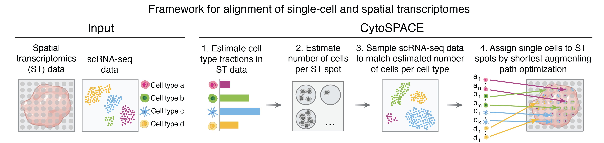 
</p>

The key innovations of our method are:

- Unlike conventional methods which calculate cell type decompositions by spot, CytoSPACE yields a reconstructed tissue specimen with both high gene coverage and spatially-resolved scRNA-seq data suitable for downstream analysis.
- CytoSPACE is highly robust to noise and returns globally optimal cell-to-spot assignments. (See the paper for full details.)
- Unlike other methods which generally operate on pre-selected marker genes or on a shared embedding space (the latter of which can erase true biological variation), CytoSPACE uses the full transcriptome without the need for batch correction, helping it retain sensitivity to subtle cell states.
- CytoSPACE is quick and simple to execute. It runs in minutes even with a single CPU on a personal laptop and requires no hyperparameter tuning or gene/feature selection.

CytoSPACE is available through a web interface at <a href="https://cytospace.stanford.edu/">cytospace.stanford.edu</a>, which enables users to run CytoSPACE with default settings without downloading the source code.

## Installation instructions (5-10 minutes)

<details><summary>Expand section</summary>

1. Install <a href="https://docs.conda.io/projects/conda/en/latest/user-guide/install/index.html" target="_blank">Miniconda</a> if not already available.

2. Clone this repository:
```bash
  git clone https://github.com/digitalcytometry/cytospace
```

3. Navigate to `cytospace` directory:
```bash
  cd cytospace
```

4. (5-10 minutes) Create a conda environment with the required dependencies:
```bash
  conda env create -f environment.yml
```

5. Activate the `cytospace` environment you just created:
```bash
  conda activate cytospace
``` 

6. (~30 seconds) Install CytoSPACE by executing:
```bash
  pip install .
``` 

7. (Recommended, ~1 minute) Install package `lapjv` by executing:
```bash
  pip install lapjv==1.3.14
```
We highly recommend you install this package, which provides a fast implementation of the default core optimization algorithm within CytoSPACE. However, some systems may not accommodate it as it requires CPU support for AVX2 instructions. To determine if your system supports this package, it is generally easiest to simply attempt to install it as above. If it installs without problems, your system will support it! If you run into an error, it is likely your system does not support it, and you can simply use one of the other options we have provided. See [__Solver options__](#cytospace-solver-options) below for details. Please note that if the package installs but you receive an "illegal instruction" error while running CytoSPACE, you may be able to build the package instead with the following command:
```bash
   pip3 install git+https://github.com/src-d/lapjv
```
For more information, see the <a href="https://pypi.org/project/lapjv/" target="_blank">lapjv documentation page</a>. 
</details>

## Input Files

<details><summary>Expand section</summary>

CytoSPACE requires 4 files as input by default. All files should be provided in tab-delimited tabular input format (saved as .txt) with no double quotations. Further formatting details for each input file are specified below. We also provide instructions on using scripts to generate input files from Seurat objects at the end of this section.

1. __A scRNA-seq gene expression file:__
- The matrix must be genes (rows) by cells (columns).
- The first row must contain the single cell IDs and the first column must contain the gene names.
- The first column (gene names) must have a header.
- The gene expression data should be represented as non-normalized counts. 
- All instances of duplicate gene names will be dropped at runtime.
<p align="center">
  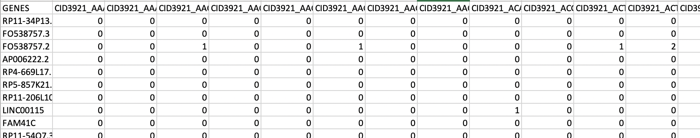 
</p>

2. __A cell type label file:__
- Cell type labels corresponding to the single cell IDs in the scRNA-seq gene expression matrix. 
- Cell type label strings should not have special characters. 
- The table should contain two columns, where column 1 contains the single cell IDs corresponding to the columns of the scRNA-seq matrix and column 2 contains the corresponding cell type labels.
- The columns must have a header. 
<p align="center">
  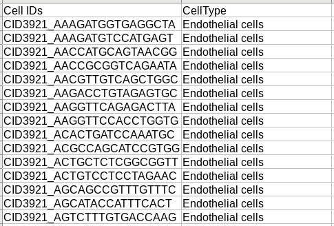 
</p>

3. __A spatial transcriptomics (ST) gene expression file:__
- The matrix must be genes (rows) by ST spots (columns).
- The first row must contain the ST spot IDs and the first column must contain the gene names.
- The first column (gene names) must have a header.
- The gene expression data should be represented as non-normalized counts. 
- All instances of duplicate gene names will be dropped at runtime.
<p align="center">
  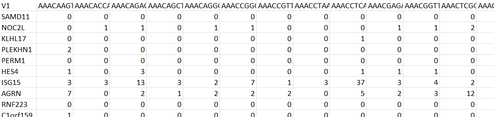 
</p>

4. __A spatial transcriptomics coordinates file:__
- A table consisting of 3 columns, where the first column contains the ST spot IDs corresponding to and in the same order as the columns of the ST gene expression matrix, and column 2 and 3 contain the row and column indices of the spatial transcriptomics data, respectively. 
- The columns must have a header. 
<p align="center">
  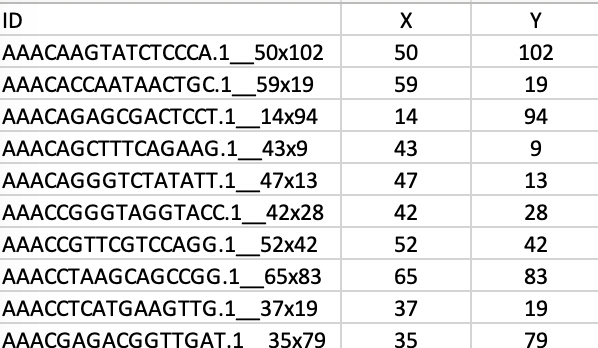 
</p>

### From Space Ranger outputs
If the users are starting from Space Ranger outputs, they can provide the ST input files as a single tar.gz, __in place of__ both (3) gene expression and (4) coordinates. If a Space Ranger output is specified, CytoSPACE will automatically attempt to unzip the provided tarball and load the correponding ST expression and coordinates data.

The tarball should only include the following:
- A single H5 file (extension .h5) containing the ST gene expression
- A single subdirectory containing the image data

With the above items inside a directory named `spaceranger_input`, a tarball can be generated using the following command:
```bash
  tar -cvzf sr_input.tar.gz spaceranger_input
```
Or more generally:
```bash
  tar -cvzf [name_of_tarball] [name_of_directory]
```

An example file tree for an unzipped tarball is shown below on the left. If downloading from the public 10X Visium data, users can download the files shown below on the right.
<p align="center">
  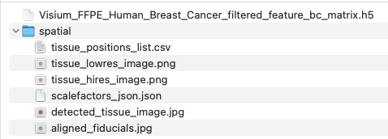 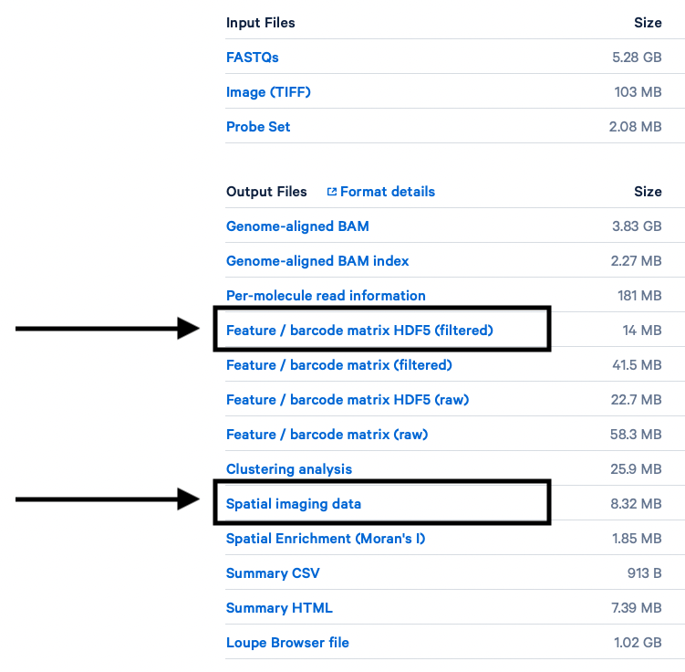
</p>

<details><summary><b>Preparing input files from Seurat objects</b></summary>

If you have data in the form of Seurat objects, you can generate files formatted for CytoSPACE input via helper functions we have provided in the `R` script `generate_cytospace_from_seurat_object.R` in `cytospace/Prepare_input_files`. To use these helper functions, first import them from `generate_cytospace_from_seurat_object.R` by including 
```bash
  source('/path/to/generate_cytospace_from_seurat_object.R')
```
in your R script. 

### From scRNA-seq Seurat object
For producing CytoSPACE inputs from scRNA Seurat objects, we provide the function `generate_cytospace_from_scRNA_seurat_object` which may be called as
```bash
  generate_cytospace_from_scRNA_seurat_object(scRNA_Seurat_Object,dir_out='',fout_prefix='')
```
within your R script. The first argument (required) designates your input Seurat object, `dir_out` (optional, default is working directory) specifies the path to the output directory to store the results, and `fout_prefix` (optional, default is none) specifies a prefix to add to output file names, which otherwise are generated as `scRNA_data.txt` and `cell_type_labels.txt`. Please note that `Idents(scRNA_Seurat_Object)` must be set to include cell types.


### From Spatial Seurat object
For producing CytoSPACE inputs from ST Seurat objects, we provide the function `generate_cytospace_from_ST_seurat_object` which may be called as
```bash
  generate_cytospace_from_ST_seurat_object(ST_Seurat_Object,dir_out='',fout_prefix='',slice='slice1')
```
within your R script. The first argument (required) designates your input Seurat object, `dir_out` (optional, default is working directory) specifies the path to the output directory to store the results, `fout_prefix` (optional, default is none) specifies a prefix to add to output file names, which otherwise are generated as `ST_data.txt` and `Coordinates.txt`, and `slice` (optional, default is `slice1`) provides the name of your slice as stored in your Seurat object.
</details>
</details>

## Running CytoSPACE

<details><summary>Expand section</summary>

After activating the `cytospace` conda environment via `conda activate cytospace`, CytoSPACE can be called from the command line from any folder using `cytospace`. Examples on how to run CytoSPACE are provided in the section "Example datasets for running CytoSPACE" below.

A typical CytoSPACE run with default settings would look like this: 
 ```bash
 cytospace \
    --scRNA-path /path/to/scRNA_geneexpression \
    --cell-type-path /path/to/scRNA_celllabels \
    --st-path /path/to/ST_geneexpression \
    --coordinates-path /path/to/ST_coordinates
```
Or with more condensed parameter names: 
 ```bash
 cytospace \
    -sp /path/to/scRNA_geneexpression \
    -ctp /path/to/scRNA_celllabels \
    -stp /path/to/ST_geneexpression \
    -cp /path/to/ST_coordinates
```

Alternatively, if starting from a Space Ranger output, the command may look like this:
```bash
 cytospace \
    --scRNA-path /path/to/scRNA_geneexpression \
    --cell-type-path /path/to/scRNA_celllabels \
    --spaceranger-path /path/to/spaceranger_output.tar.gz
```
```bash
 cytospace -sp /path/to/scRNA_geneexpression \
    -ctp /path/to/scRNA_celllabels \
    -srp /path/to/spaceranger_output.tar.gz
```

For full usage details with additional options, see the [__Extended usage details__](#extended-usage-details) section below. 

### Choosing a solver
CytoSPACE provides three solver options. In short, we recommend using the default option `lapjv` if your system supports AVX2 (i.e., if you were able to successfully install it with `pip install lapjv==1.3.14`) and `lap_CSPR` otherwise. No options are required to use the default solver `lapjv`. To use `lap_CSPR` instead, pass the argument `-sm lap_CSPR` to your `cytospace` call. For full solver details, see the [__Solver options__](#cytospace-solver-options) section below.

<details><summary><b>Other ways CytoSPACE can be run</b></summary>
 
- You can import methods or functions from `CytoSPACE` in python and modify/create your own 
    pipeline. For example:
```python
  from cytospace import cytospace

  for mean_cell_numbers in [5, 10, 20]:
      cytospace.main_cytospace(..., mean_cell_numbers=mean_cell_numbers)
```
</details>
</details>

## CytoSPACE outputs

<details><summary>Expand section</summary>

CytoSPACE will produce six output files by default.
1. ```cell_type_assignments_by_spot.pdf```<br>
Heatmaps of cell type assignments within the ST sample. Along with a plot showing the total number of cells mapped to each spot, these show the spatial distribution of cell type assignments. Color bars indicate the number of cells of the respective cell type inferred per spot.
2. ```cell_type_assignments_by_spot_jitter.pdf```<br>
A single scatterplot showing all assigned cells by their spot location. Each cell is colored based on its cell type.
3. ```assigned_locations.csv```<br>
This file will provide the assigned locations of each single cell mapped to ST spots. As some cells may be mapped to multiple locations depending on the size of the input scRNA-seq set, new cell IDs (`UniqueCID`) are assigned to each cell and given in the first column. The second column includes original cell IDs (`OriginalCID`); the third column includes corresponding cell types (`CellType`); the fourth column includes assigned spot IDs (`SpotID`); and the fifth and sixth columns respectively include  `row` and `column` indices, or xy-coordinates such as `X` and `Y` if provided in the initial coordinates file, of the corresponding spots.
4. ```cell_type_assignments_by_spot.csv```<br>
This file gives the raw number of cells of each cell type per spot by `SpotID` as well as the total number of cells assigned to that spot.
5. ```fractional_abundances_by_spot.csv```<br>
This file gives the fractional abundance of cell types assigned to each spot by `SpotID`.
6. ```log.txt```<br>
This file contains a log of CytoSPACE run parameters and running time.
</details>

## Example dataset for running CytoSPACE

<details><summary>Expand section</summary>

For users to test CytoSPACE, we have included files for an example run:
- A HER2+ breast cancer scRNA-seq atlas by Wu et al. (<a href="https://www.nature.com/articles/s41588-021-00911-1" target="_blank">Nature Genetics, 2021</a>) and a HER2+ breast cancer FFPE specimen profiled by the Visium platform (<a href="https://www.10xgenomics.com/resources/datasets/human-breast-cancer-ductal-carcinoma-in-situ-invasive-carcinoma-ffpe-1-standard-1-3-0" target="_blank">10x Genomics</a>). Default parameters were selected with Visium samples in mind and are appropriate here.


### Download example datasets
A zip file containing the example dataset can be downloaded from the following link:
- <a href="https://drive.google.com/file/d/1G8gK4MxCmRG4JZi588wloMsP8iZlQf_z/view?usp=share_link" target="_blank">Breast cancer</a>
<!-- 
To download from the command line using `gdown`:
1. Breast cancer
   ```bash
   gdown --fuzzy https://drive.google.com/file/d/1knez-rEPfLIDP6WVRINdn1RtDYmoo8BH/view?usp=share_link
   unzip CytoSPACE_example_breast_cancer.zip
   ```
2. Melanoma
   ```bash
   gdown --fuzzy https://drive.google.com/file/d/1hwK_sh355chdmW50yrPJq7_W8j6HuRHh/view?usp=share_link
   unzip CytoSPACE_example_melanoma.zip
   ``` -->
   
### Command for running example analysis:
Once the example files are downloaded and unzipped, the commands below can be run from inside the unzipped directory:
```bash
  cytospace -sp brca_scRNA_GEP.txt -ctp brca_scRNA_celllabels.txt -stp brca_STdata_GEP.txt -cp brca_STdata_coordinates.txt -o cytospace_results_brca -sm lap_CSPR
```
Please note that here we use the `lap_CSPR` solver for compatibility. If your system supports AVX2 intrinsics, you can run the same commands without the final argument to use the `lapjv` solver instead. __The CytoSPACE run should take around 5 minutes.__

### CytoSPACE output files for example breast cancer data
The main output from a CytoSPACE run is the file named `assigned_locations.csv`, which provides the ST spots to which the single cells have been assigned. 

<p align="center">
  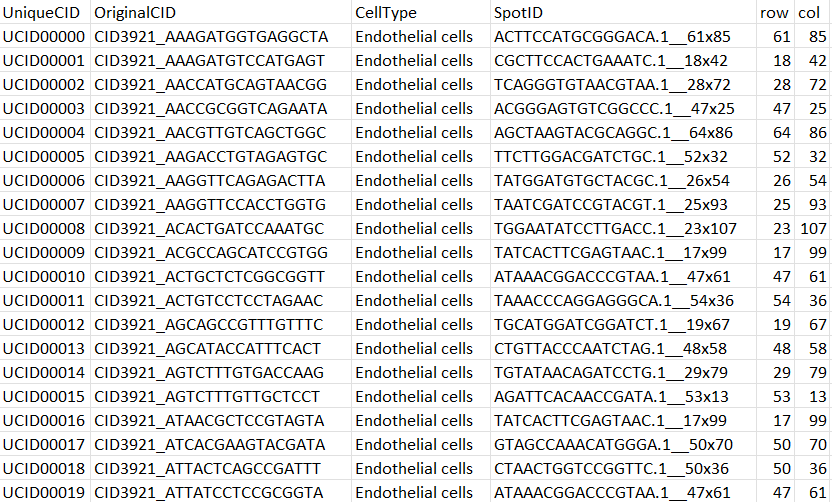
</p>

The CytoSPACE results are visualized in heatmaps saved as `cell_type_assignments_by_spot.pdf` showing the distribution of single cells across ST spots for each cell type. Color bars indicate the number of cells of the respective cell type inferred per spot. Below are the heatmaps produced for the example BRCA data.

<p align="center">
  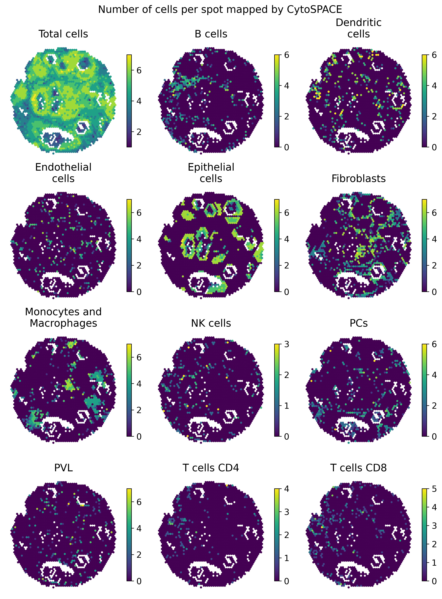
</p>

For comparison, consider the pathologist annotations of this ST sample as provided by 10x:

<p align="center">
  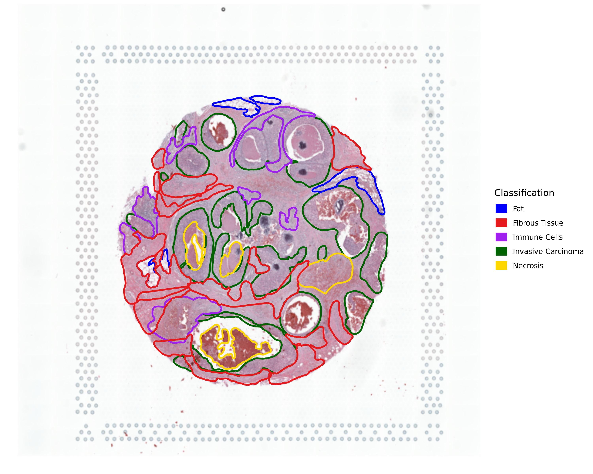
</p>

CytoSPACE also provides a scatterplot showing cells of all types at once near their spot location, saved as `cell_type_assignments_by_spot_jitter.pdf`. Each cell is colored by its cell type. The below plot is produced for the example BRCA data.

<p align="center">
  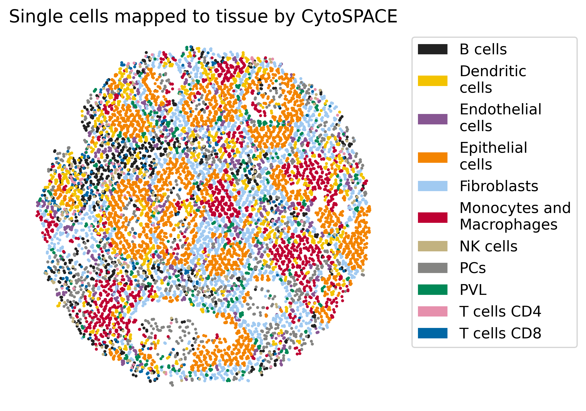
</p>

The number of cells per spot by cell type as well as in total are provided in the file `cell_type_assignments_by_spot.csv`. Fractional abundances of each cell type are returned in the file `fractional_abundances_by_spot.csv`. A log file recording CytoSPACE inputs and running times is output in the file `log.txt`.

A zip file of the expected CytoSPACE outputs (with `lap_CSPR` solver) are available to download at the following link:
- <a href="https://drive.google.com/file/d/1ZMA0XEl_pjC12mb8bZL8zI9yzYd2djbq/view?usp=share_link" target="_blank">Breast cancer results</a>

<!-- To download from the command line using `gdown`:
1. Breast cancer
   ```bash
   gdown --fuzzy https://drive.google.com/file/d/1CLfy4Txez8ThID8YzIH04hlvrBRCQ4Rh/view?usp=sharing
   unzip CytoSPACE_example_breast_cancer_results.zip
   ```
2. Melanoma
   ```bash
   gdown --fuzzy https://drive.google.com/file/d/1X4jMwctRNmqCRIJcop2hL3jRdlhxnnlc/view?usp=sharing
   unzip CytoSPACE_example_melanoma_results.zip
   ``` -->

</details>

## Running CytoSPACE on legacy ST data

<details><summary>Expand section</summary>

By default, the CytoSPACE parameters have been optimized for standard 10x Visium spatial slides. Datasets generated by the legacy ST platform can be run with similar commands, but we recommend that the following parameters be adjusted:
1. `--mean_cell_numbers`, or `-mcn`, should be set to `20`. The legacy ST platform has larger spot sizes, so we recommend mapping an average of 20 cells per spot.
2. `--geometry`, or `-g` should be set to `square`. This will allow the plot function to shape each spot as a square rather than a hexagon.

Similar to the example breast cancer dataset above, we provide an example dataset below:
- A melanoma scRNA-seq atlas by Tirosh et al. (<a href="https://www.science.org/doi/10.1126/science.aad0501?url_ver=Z39.88-2003&rfr_id=ori:rid:crossref.org&rfr_dat=cr_pub%20%200pubmed" target="_blank">Science, 2016</a>), and a melanoma specimen profiled by the legacy ST platform (Thrane et al, <a href="https://aacrjournals.org/cancerres/article/78/20/5970/631815/Spatially-Resolved-Transcriptomics-Enables" target="_blank">Cancer Research, 2018</a>).

The zip file containing the dataset can be downloaded <a href="https://drive.google.com/file/d/1hwK_sh355chdmW50yrPJq7_W8j6HuRHh/view?usp=share_link" target="_blank">here</a>.

Running CytoSPACE with the command below generates the results shown <a href="https://drive.google.com/file/d/1bX4SqrYzIXov_A5ivlJ8U0qD8_lXmmBf/view?usp=share_link" target="_blank">here</a> . The format of the output will be the same as the breast cancer dataset above. Please note that here we specify the `-ctfep` parameter instead of using CytoSPACE's internal algorithm for estimating cell fractions (see [__Advanced options__](#advanced-options) - __User-provided fractional composition of each cell type__) as the scRNA-seq atlas used as reference was generated using Smart-seq2.
```bash
  cytospace -sp melanoma_scRNA_GEP.txt -ctp melanoma_scRNA_celllabels.txt -stp melanoma_STdata_slide1_GEP.txt -cp melanoma_STdata_slide1_coordinates.txt -ctfep melanoma_cell_fraction_estimates.txt -o cytospace_results_melanoma -mcn 20 -g square -sm lap_CSPR
```
</details>

## Running CytoSPACE on single-cell ST data

<details><summary>Expand section</summary>

While designed for Visium-type data in which most spots contain RNA from multiple cells, CytoSPACE can also be used with single-cell resolution spatial data such as <a href="https://vizgen.com/resources/meet-the-merscope-platform/" target="_blank">Vizgen's MERSCOPE platform</a>. We expect this extension to be useful for reducing noise and expanding transcriptome coverage of each cell in the ST data, which in turn could allow for identifying spatially-dependent changes across genes more diverse than what a typical single-cell resolution ST platform alone can provide. For the single-cell resolution mode, CytoSPACE partitions the ST data into smaller chunks and utilizes multiple CPU cores to assign down-sampled versions of the reference scRNA-seq data to these regions.

We highly recommend that an `--st-cell-type-path` (or `-stctp`) be provided when running CytoSPACE in `--single-cell` mode. This file will list the cell type labels for each spot, in the same format as the scRNA-seq cell type labels specified under `--cell-type-path`. All of the cell types present in `--st-cell-type-path` must also be present in `--cell-type-path`.

However, if the user does not have access to the cell types for each individual spot, they can instead provide a `--cell-type-fraction-estimation-path` in place of `--st-cell-type-path`. See the [__Advaced Options__](#advanced-options) - __User-provided fractional composition of each cell type__ section regarding how this file should be formatted. Please note that for `--single-cell` mode, CytoSPACE does not support the internal estimation of cell type fraction, and the users are expected to specify either an `--st-cell-type-path` or a `--cell-type-fraction-estimation-path`.

To run CytoSPACE with single-cell resolution spatial data:
 ```bash
 cytospace --single-cell \
    --scRNA-path /path/to/scRNA_geneexpression \
    --cell-type-path /path/to/scRNA_celllabels \
    --st-path /path/to/ST_geneexpression \
    --coordinates-path /path/to/ST_coordinates \
    --st-cell-type-path /path/to/ST_celllabels \
    --number-of-processors NUMBER_OF_PROCESSORS \
    --number-of-selected-spots NUMBER_OF_SELECTED_SPOTS
```
Or with more condensed parameter names: 
 ```bash
 cytospace -sc \
    -sp /path/to/scRNA_geneexpression \
    -ctp /path/to/scRNA_celllabels \
    -stp /path/to/ST_geneexpression \
    -cp /path/to/ST_coordinates \
    -stctp /path/to/ST_celllabels \
    -nop NUMBER_OF_PROCESSORS \
    -noss NUMBER_OF_SELECTED_SPOTS
```
where `NUMBER_OF_PROCESSORS` denotes the number of cores to use, and `NUMBER_OF_SELECTED_SPOTS` denotes the number of ST spots in each partition. We generally recommend `-noss 10000`.

A zip file of example single cell inputs is available to download from Google Drive <a href="https://drive.google.com/file/d/1odOcIfY3oqvLCNdXHLRaSmTraRxqnHLp/view?usp=share_link" target="_blank">here</a>.

<!-- To download from the command line using `gdown`:
   ```bash
   gdown --fuzzy https://drive.google.com/file/d/10fhxjCn-VfPPurrI-RE8lbs6NCPqfGXY/view?usp=sharing
   unzip single_cell_example_data.zip
   ``` -->

To run CytoSPACE with this example dataset, run the following command from the location of the unzipped inputs and with your CytoSPACE conda environment active:
 ```bash
 cytospace \
    -sp HumanColonCancerPatient2_scRNA_expressions_cytospace.tsv \
    -ctp HumanColonCancerPatient2_scRNA_annotations_cytospace.tsv \
    -stp HumanColonCancerPatient2_ST_expressions_cytospace.tsv \
    -cp HumanColonCancerPatient2_ST_coordinates_cytospace.tsv \
    -stctp HumanColonCancerPatient2_ST_celltypes_cytospace.tsv \
    -o cytospace_results_crc \
    -sm lap_CSPR \
    -sc -noss 10000 -nop 2
```

Running CytoSPACE in the `--single-cell` mode will output the assignments `assigned_locations.csv`, the plot `cell_type_assignments_by_spot_single_cell.pdf`, and the log file `log.txt`. The plot generated will be a scatterplot of the cells colored by cell type, as shown below for the example dataset. The full results for the example dataset using the above command is available for download <a href="https://drive.google.com/file/d/1LTTDVGAuQ4QYkyCX6WtyBNXcnZe9fxKG/view?usp=share_link" target="_blank">here</a>.

<p align="center">
  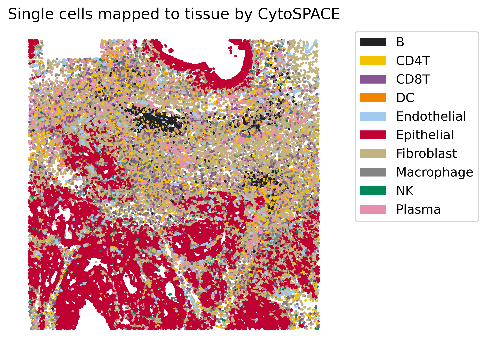
</p>

</details>

## Advanced options
While default options are recommended for most use cases, we do provide additional advanced options.

<details><summary><b>User-provided fractional composition of each cell type</b></summary>

To account for the disparity between scRNA-seq and ST data in the number of cells per cell type, CytoSPACE requires the fractional composition of each cell type in the ST tissue. By default, CytoSPACE will generate this information by internally calling the `get_cellfracs_seuratv3.R` script using the input files. This script uses `Seurat v3`, which is installed as part of the CytoSPACE environment. We highly recommend using `Seurat v3` over `Seurat v4` for the purposes of cell type fraction estimation.

While our provided script uses <a href="https://satijalab.org/seurat/articles/spatial_vignette.html" target="_blank">Spatial Seurat</a>, there is a diverse set of approaches available such as <a href="https://www.sanger.ac.uk/tool/cell2location/" target="_blank">cell2location</a>, <a href="https://github.com/MarcElosua/SPOTlight" target="_blank">SPOTlight</a>, or <a href="https://cibersortx.stanford.edu/" target="_blank">CIBERSORTx</a>.

Users can choose to provide their own file for estimated cell type composition, specified with the `--cell-type-fraction-estimation-path` (`-ctfep`) flag. In particular, we recommend that a separate `-ctfep` file be provided if the reference scRNA-seq dataset comes from technologies that are not based on UMI counts, such as Smart-seq.

The provided file must be a table consisting of 2 rows with row names, where the first row contains the cell type labels, and the second row contains the cell fractions of each cell type represented as proportions between 0 and 1. __Please make sure that the cell type labels in the first row match the labels present in the cell type label file, and that the cell type fractions sum to one. Row names must be present for both rows.__
<p align="center">
  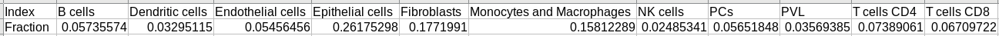
</p>
</details>

<details><summary><b>User-provided estimates of number of cells per spot</b></summary>

Rather than using the internal mechanism of CytoSPACE for estimating the number of cells per spot, users can provide their own estimates (from image segmentation, for example) in a two-column file with header, in which the first column contains spot IDs and the second contains the number of cells predicted per spot:

<p align="center">
  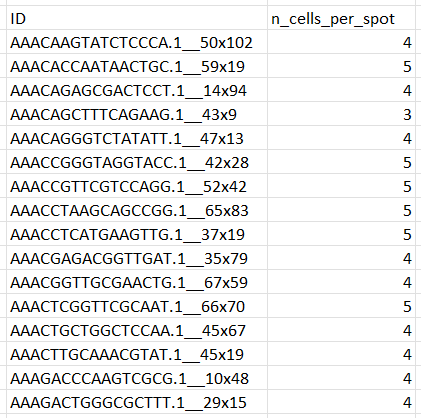
</p>

To run CytoSPACE with this option, pass the flag `-ncpsp` or `--n-cells-per-spot-path` followed by the file location.
</details>

<details><summary><b>Spot subsampling for parallelization</b></summary>

The memory and runtime required for running CytoSPACE may vary based on the number of spots. To allow for CytoSPACE to run under different conditions, we provide an option to partition the estimated number of cells in the ST sample into smaller chunks, where similarly downsampled reference scRNA-seq data are then assigned using multiple CPU cores.

The users can use this option by specifying the `--sampling-sub-spots` (`-sss`) flag, along with the desired number of subsampled cells per partition (`--number-of-selected-sub-spots`, or `-nosss`) and the number of cores to be used (`--number-of-processors`, or `-nop`).

For example, the following command will run CytoSPACE on the example breast cancer dataset, assigning scRNA-seq data to 5000 cells at a time using 2 cores:
```bash
  cytospace \
    -sp brca_scRNA_GEP.txt \
    -ctp brca_scRNA_celllabels.txt \
    -stp brca_STdata_GEP.txt \
    -cp brca_STdata_coordinates.txt \
    -o cytospace_results_brca \
    -sm lap_CSPR \
    -sss -nosss 5000 -nop 2
```
</details>

<details><summary><b>Alternative distance metric</b></summary>

By default, CytoSPACE uses Pearson correlation to compare cell and spot transcriptomes. Users can choose to use Spearman correlation or Euclidean distance instead by passing `-dm Spearman_correlation` or `-dm Euclidean` respectively with the function call. 
</details>

<details><summary><b>Setting a new random seed</b></summary>

While the CytoSPACE algorithm is mostly deterministic, the initial step of sampling cells to be mapped is done at random. To provide an alternative random seed resulting in a different random sampling of cells, users can pass `-se` followed by the desired (integer) seed with the function call. The default random seed for CytoSPACE is 1.
</details>

<details><summary><b>Alternative handling of sampling</b></summary>

CytoSPACE starts by creating a pool of cells that matches what is expected within the ST data. By default, this is done by resampling single cells to achieve the overall cell type fractions and total cell numbers estimated in the tissue. We recommend that CytoSPACE be run with this default setting for all real data analyses. However, we provide an additional option to generate new "place-holder" cells by sampling from the distribution of gene counts within each cell type instead, and used this option for ensuring uniqueness of mapped cells for benchmarking on simulated data. To run CytoSPACE with this alternative mode, users can pass `-sam place_holders` with the function call. When running in place-holder mode, the gene expression of the newly generated cells will be saved as part of the output under `new_scRNA.csv`.
</details>

<details><summary><b>Method extension: mapping quality</b></summary>

While CytoSPACE's formulation as a linear assignment problem guarantees an optimal solution given its cost function, there is no underlying probabilistic framework for estimating mapping uncertainty. One possibility is to determine whether a given cell type belongs to a given spot after mapping - that is, whether a spot contains at least one cell of the same cell type. Notably, this does not distinguish between cells of the same cell type for quality of fit. As such a protocol provides some measure of mapping quality, albeit incomplete, we provide a helper script that implements this via a support vector machine that produces and trains on pseudo-bulks generated from the input scRNA-seq data. This script, `uncertainty_quantification.R`, takes as input the path to the ST dataset count matrix file, the scRNA-seq count matrix file, and the CytoSPACE output file `assigned_locations.csv`, and returns an appended output file with confidence scores in `assigned_locationswConfidenceScores.csv`. The command to run this script following a completed CytoSPACE run is as follows: 
 ```bash
 Rscript uncertainty_quantification.R /path/to/ST_geneexpression /path/to/scRNA_geneexpression /path/to/assigned_locations.csv
```
For interpreting confidence scores, we recommend a cutoff of 0.1, with higher scores indicating increased confidence that a spot contains at least one cell of the same cell type.

Please note that `uncertainty_quantification.R` requires separate dependencies from those included in the provided `environment.yml` file for the `cytospace` conda environment. This script should be run in a separate environment with the following R packages installed: `Seurat` (must be v4; tested with v4.0.1), `data.table` (tested with v1.14.0), and `e1071` (tested with v1.7.8).
</details>

## Extended usage details

<details><summary>Expand section</summary>

```
usage: cytospace [-h] -sp SCRNA_PATH -ctp CELL_TYPE_PATH [-stp ST_PATH] [-cp COORDINATES_PATH] [-srp SPACERANGER_PATH]
                 [-stctp ST_CELL_TYPE_PATH] [-ctfep CELL_TYPE_FRACTION_ESTIMATION_PATH] [-ncpsp N_CELLS_PER_SPOT_PATH]
                 [-o OUTPUT_FOLDER] [-op OUTPUT_PREFIX] [-mcn MEAN_CELL_NUMBERS] [-sc]
                 [-noss NUMBER_OF_SELECTED_SPOTS] [-sss] [-nosss NUMBER_OF_SELECTED_SUB_SPOTS]
                 [-nop NUMBER_OF_PROCESSORS] [-sm {lapjv,lapjv_compat,lap_CSPR}]
                 [-dm {Pearson_correlation,Spearman_correlation,Euclidean}] [-sam {duplicates,place_holders}]
                 [-se SEED] [-p] [-g GEOMETRY] [-nc NUM_COLUMN] [-mp MAX_NUM_CELLS_PLOT]

CytoSPACE is a computational strategy for assigning single-cell transcriptomes to in situ spatial transcriptomics (ST)
data. Our method solves single cell/spot assignment by minimizing a correlation-based cost function through a linear
programming-based optimization routine.

optional arguments:
  -h, --help            show this help message and exit
  -stp ST_PATH, --st-path ST_PATH
                        Path to spatial transcriptomics data (expressions)
  -cp COORDINATES_PATH, --coordinates-path COORDINATES_PATH
                        Path to transcriptomics data (coordinates)
  -srp SPACERANGER_PATH, --spaceranger-path SPACERANGER_PATH
                        Path to SpaceRanger tar.gz data file
  -stctp ST_CELL_TYPE_PATH, --st-cell-type-path ST_CELL_TYPE_PATH
                        Path to ST cell type file (recommended for single-cell ST)
  -ctfep CELL_TYPE_FRACTION_ESTIMATION_PATH, --cell-type-fraction-estimation-path CELL_TYPE_FRACTION_ESTIMATION_PATH
                        Path to ST cell type fraction file (recommended for bulk ST)
  -ncpsp N_CELLS_PER_SPOT_PATH, --n-cells-per-spot-path N_CELLS_PER_SPOT_PATH
                        Path to number of cells per ST spot file
  -o OUTPUT_FOLDER, --output-folder OUTPUT_FOLDER
                        Relative path to the output folder
  -op OUTPUT_PREFIX, --output-prefix OUTPUT_PREFIX
                        Prefix of results stored in the 'output_folder'
  -mcn MEAN_CELL_NUMBERS, --mean-cell-numbers MEAN_CELL_NUMBERS
                        Mean number of cells per spot, default 5 (appropriate for Visium). If analyzing legacy spatial
                        transcriptomics data, set to 20
  -sc, --single-cell    Use single-cell spatial approach if specified
  -noss NUMBER_OF_SELECTED_SPOTS, --number-of-selected-spots NUMBER_OF_SELECTED_SPOTS
                        Number of selected spots from ST data used in eahc iteration
  -sss, --sampling-sub-spots
                        Sample subspots to limit the number of mapped cells if specified
  -nosss NUMBER_OF_SELECTED_SUB_SPOTS, --number-of-selected-sub-spots NUMBER_OF_SELECTED_SUB_SPOTS
                        Number of selected subspots from ST data to limit the number of mapped cells
  -nop NUMBER_OF_PROCESSORS, --number-of-processors NUMBER_OF_PROCESSORS
                        Number of processors used for the analysis
  -sm {lapjv,lapjv_compat,lap_CSPR}, --solver-method {lapjv,lapjv_compat,lap_CSPR}
                        Which solver to use for the linear assignment problem, default 'lapjv'
  -dm {Pearson_correlation,Spearman_correlation,Euclidean}, --distance-metric {Pearson_correlation,Spearman_correlation,Euclidean}
                        Which distance metric to use for the cost matrix, default 'Pearson_correlation'
  -sam {duplicates,place_holders}, --sampling-method {duplicates,place_holders}
                        Which underlying method to use for dealing with duplicated cells, default 'duplicates'
  -se SEED, --seed SEED
                        Set seed for random generators, default 1
  -p, --plot-off        Turn create plots on/off
  -g GEOMETRY, --geometry GEOMETRY
                        ST geometry, either 'honeycomb' or 'square' accepted
  -nc NUM_COLUMN, --num-column NUM_COLUMN
                        Number of columns in figure
  -mp MAX_NUM_CELLS_PLOT, --max-num-cells-plot MAX_NUM_CELLS_PLOT
                        Maximum number of cells to plot in single-cell visualization

Required arguments:
  -sp SCRNA_PATH, --scRNA-path SCRNA_PATH
                        Path to scRNA-Seq data
  -ctp CELL_TYPE_PATH, --cell-type-path CELL_TYPE_PATH
                        Path to cell type labels
```

You can see this list of variables and default values for running CytoSPACE from the commmand line as well at any time by calling `cytospace` along with the `-h` or 
`--help` flag, i.e., `cytospace -h`.
</details>

## CytoSPACE Solver options

<details><summary>Expand section</summary>

1. `lapjv` __(Recommended for most systems)__    By default, CytoSPACE calls the `lapjv` solver from package `lapjv`. This solver is a fast implementation of the Jonker-Volgenant shortest augmenting path assignment algorithm and returns a globally optimal solution given the objective function as defined in our paper [cite]. As noted above, however, this package is not supported on all systems as it achieves its speedup through use of AVX2 instructions. This solver will be selected by default and can be specified explicitly by passing arguments `--solver-method lapjv` or `-sm lapjv` to `cytospace`.
2. `lap_CSPR` __(Recommended for systems not supporting `lapjv`)__    A second solver option is the `linear_assignment` method from the `ortools` package. This solver uses a different method than the first and third options, an assignment algorithm called the cost scaling push relabel method. This algorithm approximates assignment costs to integer values and loses some numerical precision in doing so. Therefore, while it returns a globally optimal solution __after approximation__ given the objective function defined in the paper, it will return similar but generally not identical results to the first two methods. This solver has a similar running time to the first option and is a good option for systems not supporting the `lapjv` package. This solver can be selected by passing arguments `--solver-method lap_CSPR` or `-sm lap_CSPR` to `cytospace`.
3. `lapjv_compat`   A third solver option implements the `lapjv` solver from package `lap`. Like the first option `lapjv`, this solver also implements the Jonker-Volgenant shortest augmenting path assignment algorithm to return the same globally optimal solution given the objective function defined in the paper. Furthermore, it is broadly supported and should work on all standard operating systems. However, it takes 3-4 times as long to run as the first solver option, the `lapjv` solver from the `lapjv` package, so we only recommend it for systems that do not support the first option. This solver can be selected by passing arguments `--solver-method lapjv_compat` or `-sm lapjv_compat` to `cytospace`.
</details>

## Updating local installations

<details><summary>Expand section</summary>

To update your local installation of CytoSPACE following updates of this GitHub repository, navigate to your `cytospace` directory and execute the following commands:
```bash
  git pull
  conda env update --name cytospace --file environment.yml
  conda activate cytospace
  pip install .
```
If you have made local updates to your version of the CytoSPACE source code, you should execute 
```bash
  pip install .
``` 
before running. 
</details>

## Authors
CytoSPACE was developed in the <a href="https://anlab.stanford.edu/" target="_blank">Newman Lab</a> by

* Milad R. Vahid (miladrv)
* Erin L. Brown (erinlbrown)
* Chloé B. Steen (cbsteen)
* Wubing Zhang (WubingZhang)
* Hyun Soo Jeon (hsjeon-k)
* Aaron M. Newman (aaronmnewman)

## Contact
If you have any questions, please contact the CytoSPACE team at cytospaceteam@gmail.com.

## License
Please see the <a href="LICENSE" target="_blank">LICENSE</a> file.

## Citation
If you use CytoSPACE, please cite:  

*High-resolution alignment of single-cell and spatial transcriptomes with CytoSPACE* (Nature Biotechnology 2023)  
Milad R. Vahid*, Erin L. Brown*, Chloé B. Steen*, Wubing Zhang, Hyun Soo Jeon, Minji Kang, Andrew J. Gentles, Aaron M. Newman.  
https://www.nature.com/articles/s41587-023-01697-9
